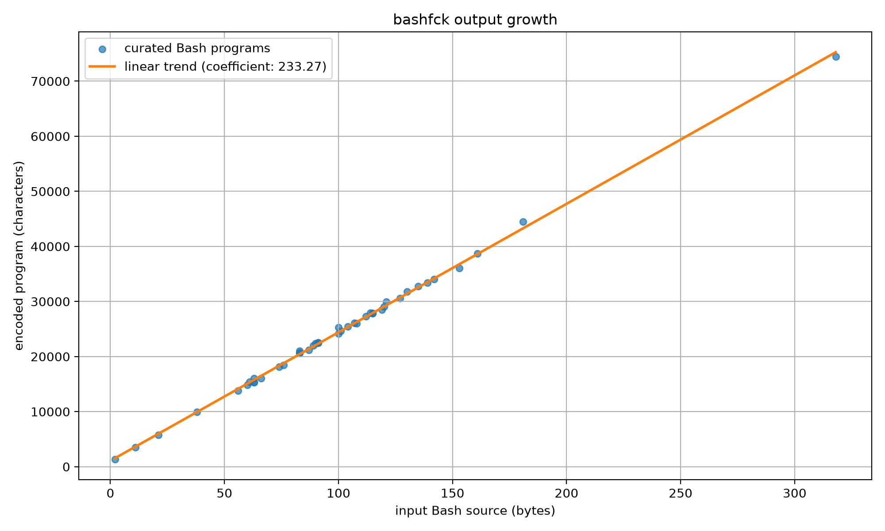

# bashfck — Bash using only 7 characters: `$'\<015`

This repository describes a method for encoding arbitrary non-NUL Bash source
using only the following seven characters:

```text
$ ' \ < 0 1 5
```

The generated program grows linearly with the size of the input program. To the
best of our knowledge, this improves on the previous publicly documented
[9-character Bash record](https://github.com/ProbiusOfficial/bashFuck) by two
characters.

This project was inspired by
[`pyfck`](https://github.com/mattyhempstead/pyfck), which applies the same
restricted-alphabet idea to Python.

Excluding only this paragraph, this entire approach and repository was designed by
ChatGPT's GPT-5.6 Thinking model in Extra High thinking mode. It took the AI
about 300 minutes of thinking over roughly 20 messages, with occasional very
minor steering and encouragement from me, the user. This project feels much
less interesting than it did just a couple of years ago when I designed
[`pyfck`](https://github.com/mattyhempstead/pyfck), specifically because of the
method used to find it. Tbh I find that observation about myself more interesting
than the project itself: my interest in projects with little real-world utility
is heavily influenced by the perceived work that went into them. I haven't even put
in the time to read or understood the solution because I don't care for it. And it's
not like it's just low quality AI slop - in fact it's better than any human has achieved
in history.

## Example

Input:

```bash
echo 'Hello, World!'
```

Generate and run it:

```bash
printf %s "echo 'Hello, World!'" | python3 bashfck.py > hello-world.bf
bash --noprofile --norc -c "$(cat hello-world.bf)"
```

Output:

```text
Hello, World!
```

To run the full seven-character encoding for `echo 'Hello, World!'`, start a
Bash terminal and copy and paste this line into it:

```bash
$0<<<$'$0<<<$\'$0<<<$\\\'\\\\1\'$\050\0505\0551\051\051$\050\0501\055\050\0551\051\051\051$\'\\\\1\'$\050\0505\055\050\0551\051\051\051$\'5\\\\151\\\\15\'$\050\0505\0551\051\051$\'\\\\1\'$\050\0505\055\050\0551\051\051\051$\050\0505\0551\051\051$\'\\\\151\\\\15\'$\050\0505\055\050\0551\051\051\051$\'\\\\0\'$\050\0505\0551\051\051$\'0\\\\1\'$\050\0505\0551\051\051$\'5\\\\1\'$\050\0505\055\050\0551\051\051\051$\050\0505\055\050\0551\051\051\051$\'\\\\1\'$\050\0505\0551\051\051$\'1\\\\15\'$\050\0505\0551\051\051$\'\\\\0\'$\050\0505\0551\051\051$\'0\\\\055\\\\055\\\\0\'$\050\0505\0551\051\051$\'0\\\\0\'$\050\0505\0551\051\051$\050\0505\0551\051\051$\'\\\\0\'$\050\0505\0551\051\051$\050\0505\055\050\0551\051\055\050\0551\051\051\051$\'\\\\1\'$\050\0505\0551\0551\051\051$\050\0505\0551\051\051$\'\\\\0\'$\050\0505\055\050\0551\051\051\051$\'1\\\\0\'$\050\0505\055\050\0551\051\051\051$\050\0505\0551\051\051$\'\\\\0\'$\050\0505\055\050\0551\051\051\051$\'5\\\\1\'$\050\0505\0551\0551\051\051$\050\0505\0551\051\051$\'\\\\0\'$\050\0505\055\050\0551\051\051\051$\'1\\\\0\'$\050\0505\055\050\0551\051\051\051$\050\0505\0551\051\051$\'\\\\0\'$\050\0505\055\050\0551\051\051\051$\050\0505\0551\0551\051\051$\'\\\\1\'$\050\0505\0551\0551\051\051$\050\0505\0551\051\051$\'\\\\0\'$\050\0505\055\050\0551\051\051\051$\'1\\\\0\'$\050\0505\055\050\0551\051\051\051$\'5\\\\0\'$\050\0505\055\050\0551\051\051\051$\'0\\\\1\'$\050\0505\0551\0551\051\051$\050\0505\0551\051\051$\'\\\\0\'$\050\0505\055\050\0551\051\051\051$\'1\\\\0\'$\050\0505\055\050\0551\051\051\051$\'5\\\\0\'$\050\0505\055\050\0551\051\051\051$\050\0505\055\050\0551\051\055\050\0551\051\051\051$\'\\\\1\'$\050\0505\0551\0551\051\051$\050\0505\0551\051\051$\'\\\\0\'$\050\0505\055\050\0551\051\051\051$\'0\\\\0\'$\050\0505\055\050\0551\051\051\051$\050\0505\0551\051\051$\'\\\\0\'$\050\0505\055\050\0551\051\051\051$\'0\\\\1\'$\050\0505\0551\0551\051\051$\050\0505\0551\051\051$\'\\\\0\'$\050\0505\055\050\0551\051\051\051$\'0\\\\0\'$\050\0505\055\050\0551\051\051\051$\050\0505\0551\051\051$\'\\\\0\'$\050\0505\055\050\0551\051\051\051$\050\0505\055\050\0551\051\055\050\0551\051\051\051$\'\\\\1\'$\050\0505\0551\0551\051\051$\050\0505\0551\051\051$\'\\\\0\'$\050\0505\055\050\0551\051\051\051$\'1\\\\0\'$\050\0505\055\050\0551\051\051\051$\'1\\\\0\'$\050\0505\055\050\0551\051\051\051$\'0\\\\1\'$\050\0505\0551\0551\051\051$\050\0505\0551\051\051$\'\\\\0\'$\050\0505\055\050\0551\051\051\051$\'1\\\\0\'$\050\0505\055\050\0551\051\051\051$\050\0505\0551\051\051$\'\\\\0\'$\050\0505\055\050\0551\051\051\051$\'5\\\\1\'$\050\0505\0551\0551\051\051$\050\0505\0551\051\051$\'\\\\0\'$\050\0505\055\050\0551\051\051\051$\'1\\\\0\'$\050\0505\055\050\0551\051\051\051$\'5\\\\0\'$\050\0505\055\050\0551\051\051\051$\050\0505\0551\051\051$\'\\\\1\'$\050\0505\0551\0551\051\051$\050\0505\0551\051\051$\'\\\\0\'$\050\0505\055\050\0551\051\051\051$\'1\\\\0\'$\050\0505\055\050\0551\051\051\051$\'5\\\\0\'$\050\0505\055\050\0551\051\051\051$\050\0505\0551\051\051$\'\\\\1\'$\050\0505\0551\0551\051\051$\050\0505\0551\051\051$\'\\\\0\'$\050\0505\055\050\0551\051\051\051$\'1\\\\0\'$\050\0505\055\050\0551\051\051\051$\'5\\\\0\'$\050\0505\055\050\0551\051\051\051$\050\0505\055\050\0551\051\055\050\0551\051\051\051$\'\\\\1\'$\050\0505\0551\0551\051\051$\050\0505\0551\051\051$\'\\\\0\'$\050\0505\055\050\0551\051\051\051$\'0\\\\0\'$\050\0505\055\050\0551\051\051\051$\'5\\\\0\'$\050\0505\055\050\0551\051\051\051$\050\0505\0551\051\051$\'\\\\1\'$\050\0505\0551\0551\051\051$\050\0505\0551\051\051$\'\\\\0\'$\050\0505\055\050\0551\051\051\051$\'0\\\\0\'$\050\0505\055\050\0551\051\051\051$\050\0505\0551\051\051$\'\\\\0\'$\050\0505\055\050\0551\051\051\051$\'0\\\\1\'$\050\0505\0551\0551\051\051$\050\0505\0551\051\051$\'\\\\0\'$\050\0505\055\050\0551\051\051\051$\'1\\\\0\'$\050\0505\055\050\0551\051\051\051$\050\0501\055\050\0551\051\051\051$\'\\\\0\'$\050\0505\055\050\0551\051\051\051$\050\0505\055\050\0551\051\055\050\0551\051\051\051$\'\\\\1\'$\050\0505\0551\0551\051\051$\050\0505\0551\051\051$\'\\\\0\'$\050\0505\055\050\0551\051\051\051$\'1\\\\0\'$\050\0505\055\050\0551\051\051\051$\'5\\\\0\'$\050\0505\055\050\0551\051\051\051$\050\0505\055\050\0551\051\055\050\0551\051\051\051$\'\\\\1\'$\050\0505\0551\0551\051\051$\050\0505\0551\051\051$\'\\\\0\'$\050\0505\055\050\0551\051\051\051$\'1\\\\0\'$\050\0505\055\050\0551\051\051\051$\050\0505\055\050\0551\051\051\051$\'\\\\0\'$\050\0505\055\050\0551\051\051\051$\050\0501\055\050\0551\051\051\051$\'\\\\1\'$\050\0505\0551\0551\051\051$\050\0505\0551\051\051$\'\\\\0\'$\050\0505\055\050\0551\051\051\051$\'1\\\\0\'$\050\0505\055\050\0551\051\051\051$\'5\\\\0\'$\050\0505\055\050\0551\051\051\051$\050\0505\0551\051\051$\'\\\\1\'$\050\0505\0551\0551\051\051$\050\0505\0551\051\051$\'\\\\0\'$\050\0505\055\050\0551\051\051\051$\'1\\\\0\'$\050\0505\055\050\0551\051\051\051$\050\0505\0551\051\051$\'\\\\0\'$\050\0505\055\050\0551\051\051\051$\050\0505\0551\051\051$\'\\\\1\'$\050\0505\0551\0551\051\051$\050\0505\0551\051\051$\'\\\\0\'$\050\0505\055\050\0551\051\051\051$\'0\\\\0\'$\050\0505\055\050\0551\051\051\051$\050\0505\0551\051\051$\'\\\\0\'$\050\0505\055\050\0551\051\051\051$\'1\\\\1\'$\050\0505\0551\0551\051\051$\050\0505\0551\051\051$\'\\\\0\'$\050\0505\055\050\0551\051\051\051$\'0\\\\0\'$\050\0505\055\050\0551\051\051\051$\050\0505\0551\051\051$\'\\\\0\'$\050\0505\055\050\0551\051\051\051$\050\0505\055\050\0551\051\055\050\0551\051\051\051$\'\\\\0\'$\050\0505\0551\051\051$\050\0505\055\050\0551\051\055\050\0551\051\051\051$\'\\\'\''
```

The encoded line is 5,555 characters long and its distinct character set is
exactly:

```text
$'015<\
```

## Core method

The construction is a sequence of Bash programs that decode and feed the next
program back into Bash.

At a high level:

```text
seven-character source
    -> stage-one Bash source
    -> stage-two Bash source
    -> builtin eval -- $'original bytes'
```

### 1. Use ANSI-C quoting as a byte constructor

Bash treats text of the form `$'...'` as an ANSI-C quoted string. Octal escapes
such as `\145` decode to individual bytes.

A normal unrestricted encoding could therefore represent source as:

```bash
$'\145\143\150\157\040\047\110\145\154\154\157\054\040\127\157\162\154\144\041\047'
```

That spells `echo 'Hello, World!'`, but it uses all eight octal digits.

The seven-character outer layer may write only octal digits `0`, `1`, and `5`
directly.

### 2. Recover the punctuation needed for arithmetic

Those three digits are enough to encode the punctuation required by Bash
arithmetic expansion:

```text
( -> 050
) -> 051
- -> 055
```

After the outer ANSI-C string is decoded, the next stage can contain `$((...))`
expressions even though `(`, `)`, and `-` never occur literally in the final
seven-character program.

The missing octal digits are generated as arithmetic results:

```text
2 -> $((1-(-1)))
3 -> $((5-1-1))
4 -> $((5-1))
6 -> $((5-(-1)))
7 -> $((5-(-1)-(-1)))
```

These expressions are part of an intermediate stage. They are themselves
encoded by the outer seven-character layer.

### 3. Re-enter the Bash parser with a here-string

Expansion results are not automatically reparsed as fresh shell syntax in the
same parsing pass. The construction therefore starts another Bash and gives it
the generated stage as standard input:

```bash
$0<<<$'NEXT_STAGE'
```

`$0` is used as the Bash executable and `<<<` is a Bash here-string. This parser
re-entry happens in three nested here-string layers.

Using `<<<` is the reduction that removes the separator and the literal `c`
required by the earlier `$0 -c ...` approach.

### 4. Evaluate the exact original bytes

The final generated stage is equivalent to:

```bash
builtin eval -- $'\145\143\150\157\040\047\110\145\154\154\157\054\040\127\157\162\154\144\041\047'
```

`builtin` selects Bash's real `eval` rather than a function with the same name.
`--` prevents source beginning with `-` from being interpreted as an option.

The original source is inside an ANSI-C quoted word, so the newline appended by
the final here-string cannot alter source ending in a backslash.

Relevant Bash documentation:

- [ANSI-C quoting](https://www.gnu.org/software/bash/manual/html_node/ANSI_002dC-Quoting.html)
- [Arithmetic expansion](https://www.gnu.org/software/bash/manual/html_node/Arithmetic-Expansion.html)
- [Here-strings and redirections](https://www.gnu.org/software/bash/manual/html_node/Redirections.html)
- [The `eval` builtin](https://www.gnu.org/software/bash/manual/html_node/Bourne-Shell-Builtins.html)

## Usage

Encode a file:

```bash
python3 bashfck.py script.sh > encoded.bf
```

Validate the input with `bash -n` before encoding:

```bash
python3 bashfck.py --check script.sh > encoded.bf
```

Read from standard input:

```bash
printf %s 'echo works' | python3 bashfck.py > encoded.bf
```

Run the result:

```bash
bash --noprofile --norc -c "$(cat encoded.bf)"
```

The result can also be pasted directly into a clean interactive Bash.

Do not rely on:

```bash
bash encoded.bf
```

In that form, `$0` becomes the encoded filename rather than an executable Bash
name.

## Assumptions and limitations

The core seven-character result assumes:

1. The output is parsed by Bash.
2. `$0` resolves to an executable Bash name or path, such as `bash` or
   `/bin/bash`.
3. Input contains no NUL byte.
4. The encoded source is trusted; this is encoding and obfuscation, not a
   security boundary.

The nested here-strings consume standard input. The original program therefore
starts with EOF on stdin.

The construction preserves the original source bytes, stdout, stderr, and final
exit status. It does not preserve parent-shell variables, functions, positional
arguments, traps, `$0`, `BASH_SOURCE`, or normal stdin.

The implementation uses longstanding Bash features, but compatibility claims
should be backed by CI against both current Bash and macOS `/bin/bash` 3.2.

## Output growth

Each input byte expands into a bounded sequence of octal digits and arithmetic
fragments, so output size is `O(n)`. The exact coefficient varies because octal
digits `2`, `3`, `4`, `6`, and `7` are more expensive than `0`, `1`, and `5`.



Generate the graph used by this README:

```bash
python3 -m pip install -r requirements-plot.txt
python3 plot_growth.py
```

The plotting script measures a curated list of distinct Bash programs across
many source lengths, then fits a linear trend. It writes `output-size.png` by
default and prints the named measurements as CSV.
